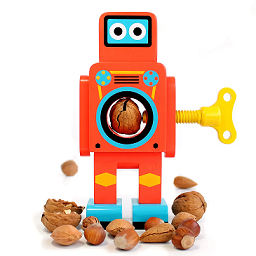

# wdio-robonut-service



### Description

wdio-robonut-service is cross platform service with access to system mouse, keyboard, clipboard, screen and seeking image templates on visible screen. With the service possible perform system move, click, type and so on. Possible check being existed and obtaining coords of image template, drag and drop it and so on.

### Instalation

```nodejs
npm install wdio-robonut-service
```

##### As service in wdio.conf.ts

```typescript
import RobotService from 'wdio-robonut-service';

// RobotConfig {
//   mouseConfig?: {autoDelayMs: number; mouseSpeed: number};
//   screenConfig?: {confidence: number; autoHighlight: boolean; highlightDurationMs: number; highlightOpacity: number; resourceDirectory:string};
//   keyboardConfig?: {autoDelayMs: number};
//   imageFinder?: {
//     confidence?: number;
//     searchMultipleScales?: boolean;
//     customOptions?: {
//         methodType?: MethodNameType;
//         scaleSteps?: Array<number>;
//         debug?: boolean;
//         roi?: Region;
//   };
// }

const robotConfig: RobotConfig = {};

export const config: Options.Testrunner = {
//-
services: [[RobotService, robotConfig]],
//-
}
```

##### As standalone

execute it wherever once after browser initialisation

```typescript
import RobotCommands from 'wdio-robonut-service';

// RobotConfig {
//   mouseConfig?: {autoDelayMs: number; mouseSpeed: number};
//   screenConfig?: {confidence: number; autoHighlight: boolean; highlightDurationMs: number; highlightOpacity: number; resourceDirectory:string};
//   keyboardConfig?: {autoDelayMs: number};
//   imageFinder?: {
//     confidence?: number;
//     searchMultipleScales?: boolean;
//     customOptions?: {
//         methodType?: MethodNameType;
//         scaleSteps?: Array<number>;
//         debug?: boolean;
//         roi?: Region;
//   };
// }

const robotConfig: RobotConfig = {};

new RobotCommands(browser, robotConfig)
```

### Usage, Examples

```typescript
import { Button } from "wdio-robonut-service/build/src/types";

browser.robot() //main point access

async function dragAndDropImage(imageDrag: ImageElement,imageDrop: ImageElement, timeout: number = 10000) {
await (await browser.robot()).image.dragAndDrop(
{ pathToImage: imageDrag.pathToImage},
{ pathToImage: imageDrop.pathToImage}, 
{ highLight: timeout/10 , waitTimeout:timeout });
}

async function dragAndDropImageWithNestedImage(imageDrag: ImageElement,imageDrop: ImageElement, timeout: number = 10000 ) {
await (await browser.robot()).image.dragAndDrop(
      { pathToImage: imageDrag.pathToImage, pathToNestedImage: imageDrag.pathToNestedImage },
      { pathToImage: imageDrop.pathToImage, pathToNestedImage: imageDrop.pathToNestedImage },
      { highLight: timeout/10 , waitTimeout:timeout },
    );
}

async function clickImage(image: ImageElement,  
options: WaitUntilOptions = { interval: 2500, timeout: 10000 }) {
    await (await browser.robot()).image.waitForImageDisplayed(image, options);
    const location = await (await browser.robot()).imageFinder.finder.findMatch({ needle: image.pathToImage });
    const point = await (await browser.robot()).rect.centerOf(location.location);
    await (await browser.robot()).mouse.move(await (await browser.robot()).rect.straightTo(point));
    await (await browser.robot()).mouse.click(Button.LEFT);
}

async function isWaitForImageDisplayed(image: ImageElement, 
options: WaitUntilOptions = { interval: 2500, timeout: 10000 }) {
    try {
      return (await browser.waitUntil(
        async () => {
          return !!(await (await browser.robot()).imageFinder.finder.findMatch({ needle: image.pathToImage })).location.left;
        }, options
      )) as true;
    } catch {
      return false;
    }
}
```

### API

```typescript
      robot: () => Promise<{
        rect: {
          straightTo: (target: Point | Promise<Point>) => Promise<Point[]>;
          centerOf: (target: Region | Promise<Region>) => Promise<Point>;
          randomPointIn: (target: Region | Promise<Region>) => Promise<Point>;
        };
        image: {
          clickImage: (image: ImageElement, options: WaitUntilOptions) => Promise<void>;
          isWaitForImageDisplayed: (image: ImageElement, options?: WaitUntilOptions) => Promise<boolean>;
          waitForImageDisplayed: (image: ImageElement, options?: WaitUntilOptions) => Promise<true | void>;
          highlightDisplayedImage: (image: ImageElement, options?: WaitUntilOptions & { highLight?: number }) => Promise<void>;
          dragAndDrop: (dragImage: ImageElement, dropImage: ImageElement, options?: RobotDragAndDropType) => Promise<void>;
        };
        mouse: MouseClass;
        screen: ScreenClass;
        keyboard: KeyboardClass;
        windowApiProvider: WindowProviderInterface;
        clipboard: { sys: SysClipboard; virt: ClipboardClass };
        imageFinder: {
          finder: TemplateMatchingFinder;
          reader: { imageResource: (fileName: string) => Promise<Image>; loadImage: (parameters: string) => Promise<Image>; saveImage: (parameters: ImageWriterParameters) => Promise<void> };
        };
      }>;
```

### Features

- [x] Robot interfaces
- [x] Image robot
- [ ] Dom element robot (by locators)

### Constraints

- Working with visible display (not headless)
- Working in one thread/instance;
